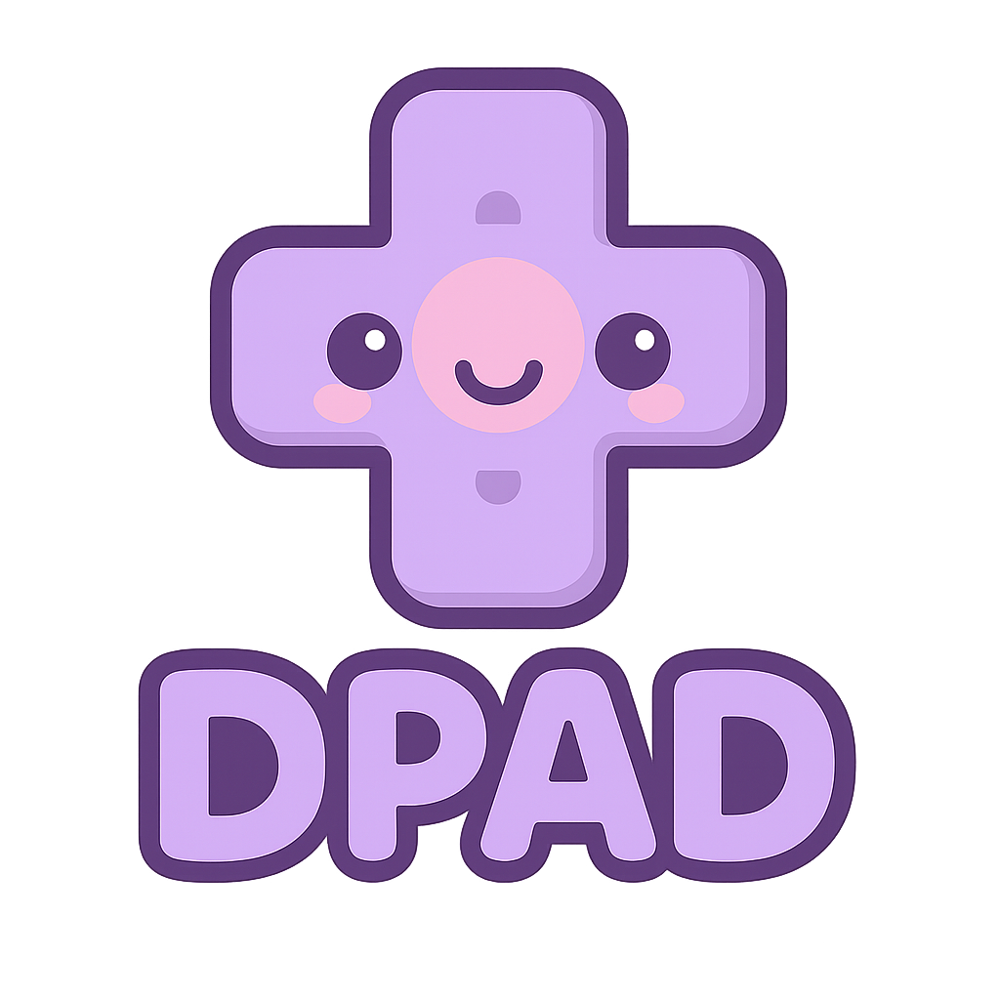

<h1 align="center">
  📺 Dpad
  <br>
  <span style="font-size: 0.6em; font-weight: normal;">Flutter TV Navigation System</span>
</h1>

<p align="center">
  <a href="README_CN.md">
    
  </a>
</p>

<p align="center">
  
</p>

<br>

<p align="center">
  <a href="https://pub.dev/packages/dpad">
    
  </a>
  <a href="https://github.com/fluttercandies/dpad">
    
  </a>
  <a href="https://github.com/fluttercandies/dpad/blob/main/LICENSE">
    
  </a>
</p>

<div align="center" style="padding: 20px; max-width: 600px; margin: 0 auto; text-align: center;">
  <strong>A simple yet powerful D-pad navigation system that makes Flutter development for Android TV, Fire TV, and other TV platforms as easy as native Android development.</strong>
</div>

## ✨ Features

- 🎯 **Simple Setup**: Just 3 steps to get started
- 🎨 **Customizable Effects**: Built-in focus effects + custom builders
- 📺 **Platform Support**: Android TV, Fire TV, Apple TV, and more
- ⚡ **Performance**: Optimized for smooth navigation
- 🔧 **Programmatic Control**: Full API for programmatic navigation
- 🎮 **Game Controller Support**: Works with standard controllers
- 🔄 **Sequential Navigation**: Previous/Next support for media and lists

## 🚀 Quick Start

### 1. Add Dependency

```yaml
dependencies:
  dpad: any
```

### 2. Wrap Your App

```dart
import 'package:dpad/dpad.dart';

void main() {
  runApp(
    DpadNavigator(
      enabled: true,
      child: MaterialApp(
        home: MyApp(),
      ),
    ),
  );
}
```

### 3. Make Widgets Focusable

```dart
class MyScreen extends StatelessWidget {
  @override
  Widget build(BuildContext context) {
    return Column(
      children: [
        DpadFocusable(
          autofocus: true,
          onFocus: () => print('Focused'),
          onSelect: () => print('Selected'),
          builder: (context, isFocused, child) {
            return AnimatedContainer(
              duration: Duration(milliseconds: 200),
              decoration: BoxDecoration(
                border: Border.all(
                  color: isFocused ? Colors.blue : Colors.transparent,
                  width: 3,
                ),
                borderRadius: BorderRadius.circular(8),
              ),
              child: child,
            );
          },
          child: ElevatedButton(
            onPressed: () => print('Pressed'),
            child: Text('Button 1'),
          ),
        ),
        
        DpadFocusable(
          onSelect: () => print('Button 2 selected'),
          child: ElevatedButton(
            onPressed: () => print('Pressed'),
            child: Text('Button 2'),
          ),
        ),
      ],
    );
  }
}
```

## 🎨 Focus Effects

### Built-in Effects

```dart
// Border highlight
DpadFocusable(
  builder: FocusEffects.border(color: Colors.blue),
  child: MyWidget(),
)

// Glow effect
DpadFocusable(
  builder: FocusEffects.glow(glowColor: Colors.blue),
  child: MyWidget(),
)

// Scale effect
DpadFocusable(
  builder: FocusEffects.scale(scale: 1.1),
  child: MyWidget(),
)

// Gradient background
DpadFocusable(
  builder: FocusEffects.gradient(
    focusedColors: [Colors.blue, Colors.purple],
  ),
  child: MyWidget(),
)

// Combine multiple effects
DpadFocusable(
  builder: FocusEffects.combine([
    FocusEffects.scale(scale: 1.05),
    FocusEffects.border(color: Colors.blue),
  ]),
  child: MyWidget(),
)
```

### Custom Effects

```dart
DpadFocusable(
  builder: (context, isFocused, child) {
    return Transform.scale(
      scale: isFocused ? 1.1 : 1.0,
      child: AnimatedContainer(
        duration: Duration(milliseconds: 300),
        decoration: BoxDecoration(
          boxShadow: isFocused ? [
            BoxShadow(
              color: Colors.blue.withValues(alpha: 0.6),
              blurRadius: 20,
              spreadRadius: 2,
            ),
          ] : null,
        ),
        child: child,
      ),
    );
  },
  child: Container(
    child: Text('Custom Effect'),
  ),
)
```

## 🔧 Advanced Usage

### 📜 Auto-Scroll (New in v1.2.2)

`DpadFocusable` now automatically scrolls to ensure the focused widget is fully visible, including focus effects like glow and borders.

```dart
DpadFocusable(
  autoScroll: true,           // Enable auto-scroll (default: true)
  scrollPadding: 24.0,        // Extra padding for focus effects (default: 24.0)
  builder: FocusEffects.glow(glowColor: Colors.blue),
  child: MyWidget(),
)

// Disable auto-scroll for specific widgets
DpadFocusable(
  autoScroll: false,
  child: MyWidget(),
)

// Programmatic scroll control
Dpad.scrollToFocus(
  focusNode,
  padding: 32.0,
  duration: Duration(milliseconds: 300),
  curve: Curves.easeOutCubic,
);
```

## 🧠 Focus Memory (Updated in v1.2.2)

The focus memory system intelligently remembers user's focus positions and restores them when navigating back, providing a more natural TV navigation experience.

### Quick Setup

```dart
DpadNavigator(
  focusMemory: FocusMemoryOptions(
    enabled: true,
    maxHistory: 20,
  ),
  onNavigateBack: (context, previousEntry, history) {
    if (previousEntry != null) {
      previousEntry.focusNode.requestFocus();
      return KeyEventResult.handled;
    }
    return KeyEventResult.ignored;
  },
  child: MyApp(),
)
```

### Region Identification

```dart
// Tab bar
DpadFocusable(
  region: 'tabs',
  child: TabButton(),
)

// Filter area
DpadFocusable(
  region: 'filters',
  child: FilterOption(),
)

// Content cards
DpadFocusable(
  region: 'cards',
  child: ContentCard(),
)
```

### Use Cases

- **Tab Navigation**: Tab A → Browse → Tab B → Back → Tab B (restores previous tab)
- **Filter Navigation**: Filter A → Browse → Filter A → Back → Filter A (restores previous filter)
- **Cross-Route Navigation**: Maintains separate focus history per route

### Custom Shortcuts

```dart
DpadNavigator(
  customShortcuts: {
    LogicalKeyboardKey.keyG: () => _showGridView(),
    LogicalKeyboardKey.keyL: () => _showListView(),
    LogicalKeyboardKey.keyR: () => _refreshData(),
    LogicalKeyboardKey.keyS: () => _showSearch(),
  },
  onMenuPressed: () => _showMenu(),
  onBackPressed: () => _handleBack(),
  child: MyApp(),
)
```

**Default Keyboard Shortcuts (v1.1.0+):**
- **Arrow Keys**: Directional navigation (up, down, left, right)
- **Tab/Shift+Tab**: Sequential navigation (next/previous)
- **Media Track Next/Previous**: Media control navigation
- **Channel Up/Down**: TV remote sequential navigation
- **Enter/Select/Space**: Trigger selection action
- **Escape/Back**: Navigate back
- **ContextMenu**: Show menu

### Programmatic Navigation

```dart
// Navigate in directions
Dpad.navigateUp(context);
Dpad.navigateDown(context);
Dpad.navigateLeft(context);
Dpad.navigateRight(context);

// Sequential navigation (new in v1.1.0)
Dpad.navigateNext(context);      // Tab / Media Track Next
Dpad.navigatePrevious(context);   // Shift+Tab / Media Track Previous

// Focus management
final currentFocus = Dpad.currentFocus;
Dpad.requestFocus(myFocusNode);
Dpad.clearFocus();
```

### Platform-Specific Handling

```dart
DpadNavigator(
  onMenuPressed: () {
    // Handle menu button on TV remotes
    _showMenu();
  },
  onBackPressed: () {
    // Handle back button
    if (Navigator.canPop(context)) {
      Navigator.pop(context);
    }
  },
  child: MyApp(),
)
```

## 📱 Platform Support

- **Android TV**: Full native D-pad support
- **Amazon Fire TV**: Compatible with Fire TV remotes
- **Apple TV**: Works with Siri Remote (Flutter web)
- **Game Controllers**: Standard controller navigation
- **Generic TV Platforms**: Any D-pad compatible input

## 💡 Best Practices

1. **Always set `autofocus: true`** on one widget per screen for initial focus
2. **Test with real D-pad hardware**, not just keyboard arrows
3. **Consider focus order** - arrange widgets logically for navigation
4. **Provide clear visual feedback** - use prominent focus indicators
5. **Handle edge cases** - what happens when navigation fails?

## 🏗️ Architecture

The system consists of three main components:

- **DpadNavigator**: Root widget that captures D-pad events
- **DpadFocusable**: Wrapper that makes widgets focusable
- **Dpad**: Utility class for programmatic control

All components work together seamlessly with Flutter's focus system.

## 🔄 Migration

Coming from other TV navigation libraries?

- ✅ No complex configuration needed
- ✅ Works with standard Flutter widgets
- ✅ No custom FocusNode management required
- ✅ Built-in support for all TV platforms
- ✅ Extensive customization options

## 📖 Example

Check out the [example app](./example) for a complete implementation showing:
- Grid navigation
- List navigation
- Custom focus effects
- Programmatic navigation
- Platform-specific handling

## 🤝 Contributing

Contributions are welcome! Please feel free to submit a Pull Request.

## 📄 License

This project is licensed under the MIT License - see the [LICENSE](LICENSE) file for details.
